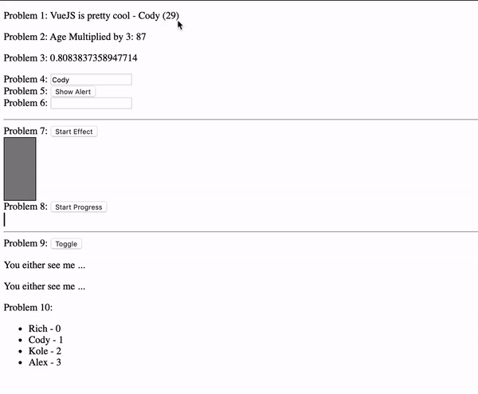

# WEB 2630 Exercise 1
> In this exercise you will be practicing the basic functionality of VueJS.

You will be creating a small VueJS application using the basic syntax we have covered in class. This will consist of interacting with the DOM, using conditionals, and rendering lists. Below is a GIF displaying the final outcome.

## Exercise Steps

1. Create WEB2630_Exercise 1 Repository on GitHub
    * Note: Make Repository Private
2. Open Terminal or Command Prompt
    i. Clone Templategit clone --bare https://github.com/CodySquadroni/WEB2630_Exercise1
        * Note: Make sure to 'cd' to a directory you want it downloaded to.
    ii. cd Into WEB2630_Exercise1.git
    iii. Copy Template Into Your Repository
        * git push --mirror https://github.com/GITHUB_USERNAME/WEB2630_Exercise1
            * Note: Make sure to put your GitHub Username in place of GITHUB_USERNAME
3. Complete ToDo's in index.html
4. Connect WEB2630_Exercise1 to Netlify
5. Submit Your GitHub and Netlify URL on Canvas

**Note: Remember to make your GitHub repository private and add me as a collaborator GitHub username: CodySquadroni**

## Final Outcome

